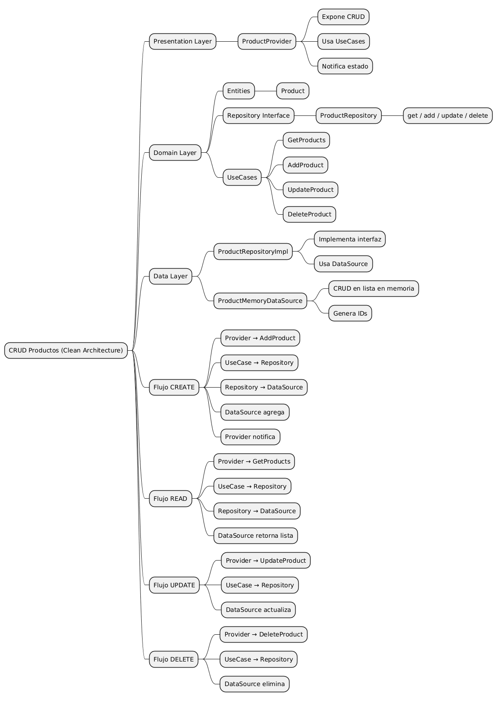
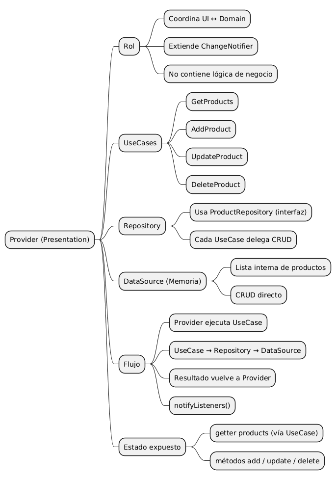
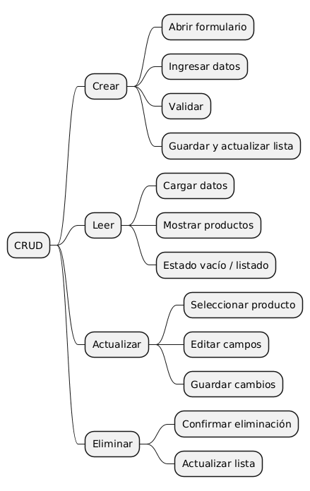

# Clean Architecture - Flutter

[](https://flutter.dev)
[](https://dart.dev)

Proyecto de ejemplo que implementa **Clean Architecture** en Flutter con un CRUD de productos. Este proyecto demuestra la separación de responsabilidades en tres capas principales: Domain, Data y Presentation, siguiendo principios SOLID y patrones de diseño modernos.

## 📋 Descripción

Aplicación Flutter que gestiona un catálogo de productos con operaciones CRUD (Crear, Leer, Actualizar, Eliminar). El proyecto está estructurado siguiendo los principios de Clean Architecture, lo que garantiza:

- ✅ Separación clara de responsabilidades
- ✅ Código testeable y mantenible
- ✅ Independencia de frameworks y librerías externas
- ✅ Facilidad para escalar y agregar nuevas funcionalidades

## 🏗️ Arquitectura

El proyecto está organizado en tres capas:

```
lib/
├── domain/          # Lógica de negocio pura
│   ├── entities/
│   ├── repositories/
│   └── use_cases/
├── data/            # Implementación de acceso a datos
│   ├── datasources/
│   └── repositories/
└── presentation/    # UI y gestión de estado
    ├── design/      # Atomic Design components
    ├── providers/
    └── screens/
```

### 📚 Documentación Detallada

Para entender en profundidad cada capa del proyecto, consulta la documentación especializada:

- **[Clean Architecture Overview](docs/clean_architecture.md)** - Visión general de la arquitectura y cómo interactúan las capas
- **[Capa Domain](docs/domain.md)** - Entidades, casos de uso y contratos del dominio
- **[Capa Data](docs/data.md)** - Implementación de repositorios y fuentes de datos
- **[Capa Presentation](docs/presentation.md)** - UI con Atomic Design y gestión de estado con Provider

## 🚀 Características

- **CRUD Completo**: Crear, leer, actualizar y eliminar productos
- **Gestión de Estado**: Implementado con Provider
- **Atomic Design**: Componentes UI organizados en átomos, moléculas, organismos y templates
- **Datasource en Memoria**: Almacenamiento local con generación automática de IDs
- **IDs Automáticos**: Formato `PRO-001`, `PRO-002`, etc.
- **Validación de Formularios**: Validación de campos requeridos y formatos

## 🛠️ Tecnologías

- **Flutter**: Framework UI multiplataforma
- **Dart**: Lenguaje de programación
- **Provider**: Gestión de estado reactiva
- **Clean Architecture**: Patrón arquitectónico

## 📦 Instalación

1. **Clonar el repositorio**
   ```bash
   git clone https://github.com/JulioViche/clean_architecture.git
   cd clean_architecture
   ```

2. **Instalar dependencias**
   ```bash
   flutter pub get
   ```

3. **Ejecutar la aplicación**
   ```bash
   flutter run
   ```

## 📱 Uso

La aplicación permite gestionar un catálogo de productos:

1. **Ver productos**: La pantalla principal muestra todos los productos registrados
2. **Agregar producto**: Botón flotante (+) para crear un nuevo producto
3. **Editar producto**: Icono de lápiz en cada tarjeta de producto
4. **Eliminar producto**: Icono de papelera con confirmación

## 🧪 Pruebas

```bash
flutter test
```

## 📊 Diagramas

El proyecto incluye diagramas visuales que explican la arquitectura y flujos:

### Mapa Mental - CRUD a Nivel de Arquitectura

Muestra el flujo de operaciones CRUD a través de las tres capas:



### Mapa Mental - Provider

Explica cómo funciona Provider en la aplicación:



### Mapa Mental - CRUD UI

Flujo de interacción del usuario con la interfaz:



## 📄 Licencia

Este proyecto es de código abierto y está disponible bajo la licencia MIT.

## 👨‍💻 Autores

**Julio Viche**
- GitHub: [@JulioViche](https://github.com/JulioViche)

**Denise Rea**
- GitHub: [@DeniseRea](https://github.com/DeniseRea)

## 🤝 Contribuciones

Las contribuciones son bienvenidas. Por favor, abre un issue o pull request para sugerencias o mejoras.

---

**Nota**: Este es un proyecto educativo para demostrar la implementación de Clean Architecture en Flutter.